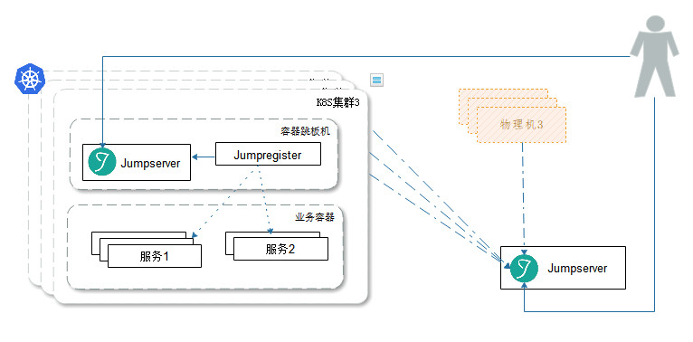
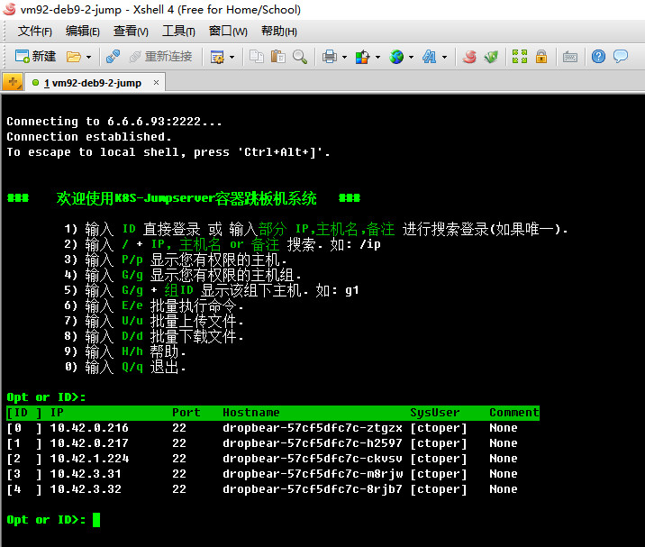
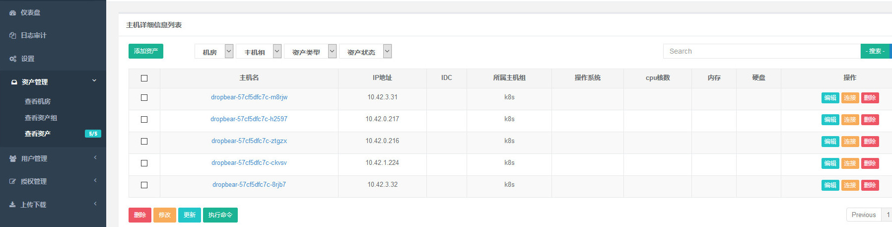
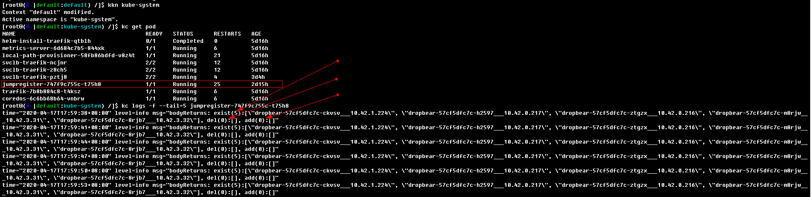

# k8s-jumpserver

K8S容器版跳板机，POD自注册，还原传统体验 方便开发调试及线上问题排查

## 一、部署拓扑

- 1.全内置： jumpserver无状态
- 2.Jumpserver外置，可与物理机混合管理，可管理多个K8S集群



## 二、Modules

- 1.jumpregister Jumpserver自注册
- 2.jumpserver 0.3.x版Jumpserver跳板机
- 3.alpine-ext:weak 轻量sshd (业务负载的基础镜像层)

## 三、快速开始

**帐号信息**

```text
web: jumpadmin jumpadmin 端口:8888
ssh: jumpadmin jumpadmin 端口:2222
```

- [docs | 外置版Jumpserver](docs/jump-multi-k8s.md)
- [docs | 设计简介](docs/1.K8S_Jumpserver跳板机设计简介.md)
- [docs | 使用指南](docs/2.K8S_Jumpserver跳板机使用指南.md)

**1.一条指令快速初始** (现有集群，jumpserver内置版)

```bash
kc apply -k https://gitee.com/infrastlabs/k8s-jumpserver//deploy #初始指令
kc -n kube-systen get po -w #跟进pod初始化进度
```

(注: `kc` 为 `kubectl`的简写: `ln -s /usr/local/bin/kubectl kc`, `dcp`为`docker-compose`简写)

**2.无集群快速体验：[初始k3s轻集群](k3s/README.md) > 执行上一步**

**ref**

- kubernetes-auto-ingress https://github.com/hxquangnhat/kubernetes-auto-ingress
- kubetop https://github.com/siadat/kubetop

## 四、效果图

- ssh控制台



- 容器列表



## 五、TODO/路线规划

- ~~DockerfileBuild, ref: rbac-manager~~ Done.
- ~~flags: SERVER_URL, SYNC_TIME, MATCH_LABEL, KUBECONFIG,~~ Done.
- ~~conn err noExit~~ just lets it got err exit. will be pulled up by k8s.
- 重点: 支持非ssh的方法管理docker容器/k8s下的pod，参考`docker exec` `kubectl exec` `kubectl-debug`的实现


## 附1：K8S容器自注册说明

**1.条目项**

- 在K8S内跑jumpregister，定时扫描符合条件的pod，推送信息到跳板机注册
- 通过给业务编排的yaml设定Label `regist-jumpserver/enabled: enabled` Env `SSHD_ENABLE=true`  两处信息，以支持跳板机自动注册
- 基础容器的支持：当前跳板基于ssh来管理容器，容器镜像需要sshd的支持，建议用轻量的`dropbear` 详参考：`registry.cn-shenzhen.aliyuncs.com/infrastlabs/alpine-ext:weak`

jumpregister推送返回日志如下图(里面有相对上一次的: exist/add/del详细记录)



## 附2:容器跳板机说明

基于官方`0.3.x`最后的一次commit`3533c010`做优化及适配K8S模式。原理：在K8S容器内启用轻量级的`dropbear`ssh-server；通过`jumpregister`定时推送最新POD清单到容器跳板机。Jumpserver可外置也可内置于集群内。`0.3.x`相比官方最新版本具有`小巧轻量` `专注便捷`同时又具备`核心功能`的特性，更适合仅通过web管理面板授权、SSH远程跳板连接的场景。

**优化改动**

- fix:下载用户时不删除key，可重复下载
- fix:适配AlineLinux的/etc/shadow登录问题
- fix:容器环境下的cron定时清理修复
- 开启Jumpserver平台用户ssh密码登录
- 初始`jumpadmin`管理员，初始`ctoper` `ctapp`两个系统用户，设置项初始`root`管理用户
- feat: 实现批量主机推送接口`/hostpush/batch`，配合`jumpregister`一同使用
- 优化Dockerfile构建 `Dockerfile-env` `Dockerfile-dist`
- 
- 跟进官方最新变更，并做对比说明
- 批量优化界面样式: 1.class="col-sm-12"行覆盖整页； 2.去除无用"config"板手图标
- 优化管理员及普通用户图标
- nav菜单项优化布局
- 切换skin处 改静态图标
- 修改文案： K8S-Jumpserver | 容器跳板机系统； 2016-2020, devcn.fun容器版
