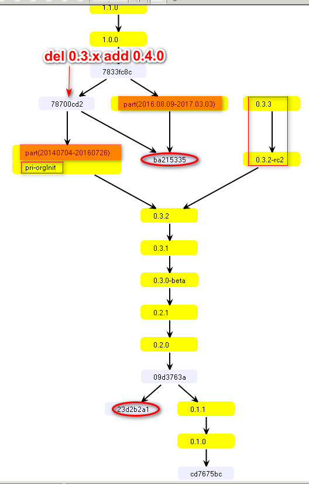
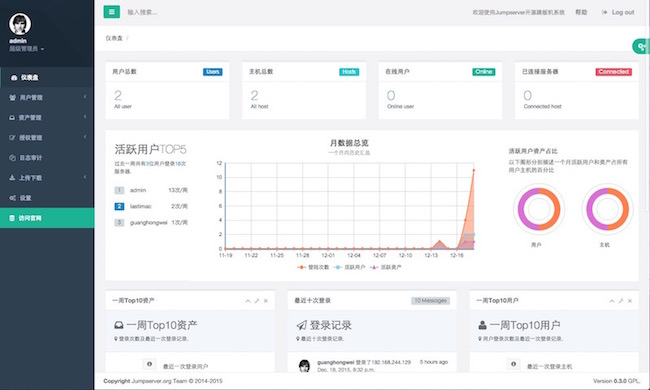
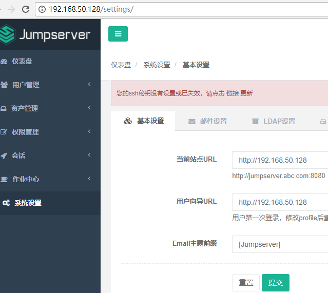

# k8s-jumpserver

K8S容器版跳板机，POD自注册，还原传统体验 方便开发调试及线上问题排查

## 一、部署拓扑

- 全内置： jumpserver无状态
- jumpserver外置，可与物理机混合管理，可管理多个K8S集群

## 二、Modules

- 1.jumpregister Jumpserver自注册
- 2.jumpserver 0.3.x版Jumpserver跳板机
- 3.alpine-ext:weak 轻量sshd (业务负载的基础镜像层)

## 三、快速开始

**1.现有集群**

```bash
kc apply -k https://gitee.com/infrastlabs/k8s-jumpserver//deploy
kc -n kube-systen get po -A
```

**[2.初始k3s轻集群](k3s/README.md) 再执行上一步**

**ref**

- kubernetes-auto-ingress https://github.com/hxquangnhat/kubernetes-auto-ingress
- kubetop https://github.com/siadat/kubetop

## 四、效果图

TODO

## 五、TODO

- ~~DockerfileBuild, ref: rbac-manager~~ Done.
- ~~flags: SERVER_URL, SYNC_TIME, MATCH_LABEL, KUBECONFIG,~~ Done.
- conn err noExit


## 附1:容器跳板机说明

基于官方`0.3.x`最后的一次commit`3533c010`做优化及适配K8S模式。原理：在K8S容器内启用轻量级的`dropbear`ssh-server；通过`jumpregister`定时推送最新POD清单到容器跳板机。Jumpserver可外置也可内置于集群内。`0.3.x`相比官方最新版本具有`小巧轻量` `专注便捷`同时又具备`核心功能`的特性，更适合仅通过web管理面板授权、SSH远程跳板连接的场景。

**优化改动**

- fix:下载用户时不删除，可重复下载
- fix:适配AlineLinux的/etc/shadow登录问题
- fix:容器环境下的cron定时清理修复
- 开启Jumpserver平台用户ssh密码登录
- 初始`jumpadmin`管理员，初始`ctoper` `ctapp`两个系统用户，设置项初始`root`管理用户
- feat: 实现批量主机推送接口`/hostpush/batch`，配合`jumpregister`一同使用
- 优化Dockerfile构建 `Dockerfile-env` `Dockerfile-dist`
- 
- 跟进官方最新变更，并做对比说明
- 批量优化界面样式: 1.class="col-sm-12"行覆盖整页； 2.去除无用"config"板手图标
- 优化管理员及普通用户图标
- nav菜单项优化布局
- 切换skin处 改静态图标
- 修改文案： K8S-Jumpserver | 容器跳板机系统； 2016-2020, devcn.fun容器版

## 版本号

- v0.3.x part(20140704-20160726)
- v0.4.0 part(20160809-20170303)
- 
- v1.0.0  20170303-20180314
- v1.3.3  20180725
- v1.4.10 20190430
- v1.5.6  20200203

## v0.3.x 分支图



## UI对比

- v030



- v050


