# K8S_Jumpserver跳板机使用指南

------

* 编写日期：2020年4月
* 文档版本：1.0

## 一、使用教程

## 1.SSH终端使用(密码模式)

- 连接配置（注意端口为四个2）  默认帐号密码都是 `jumpadmin`

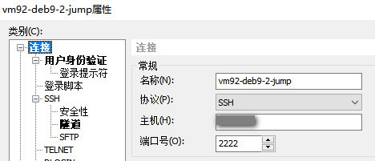

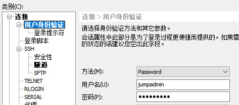

- 跳到容器内管理(预置了ctapp, ctoper两个系统用户。 后者`sudo su`可免密码到root下进行管理维护，前者应用帐号 可给来开发调试应用看日志)

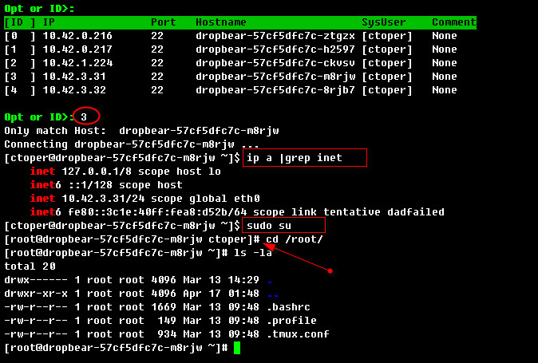

- 容器内调试 （使用dig命令检查dns为例）

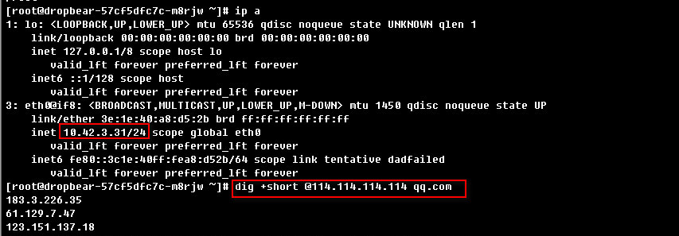

## 二、功能项说明

- 1.登陆、大盘
- 2.跳板机用户列表、容器/主机列表、授权管理
- 3.操作日志审计
- 4.设置、文件上传下载
- 5.SSH下 rz/sz上传下载文件(SSH下特有、web控制台无此功能)
- 
- 附1：K8S容器自注册说明
- 附2：容器跳板机说明

### 1.登陆、大盘

- 登录

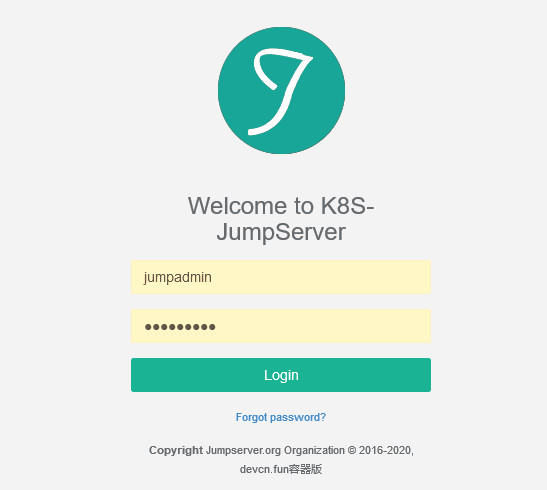

- 主面板

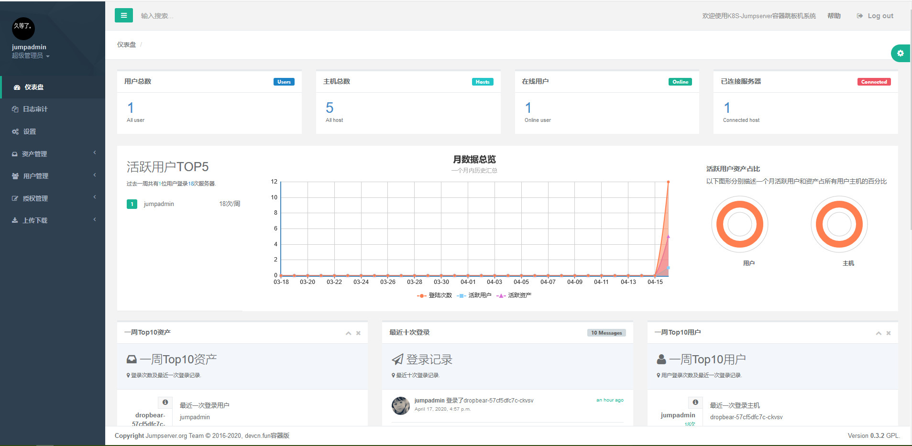

### 2.跳板机用户列表、容器/主机列表、授权管理

- 用户

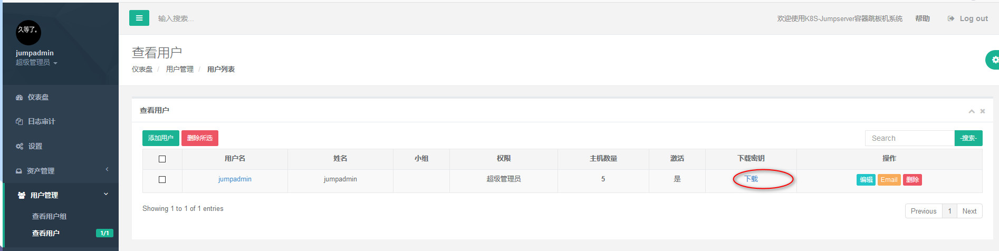

- 容器列表

- 系统用户、jump用户授权

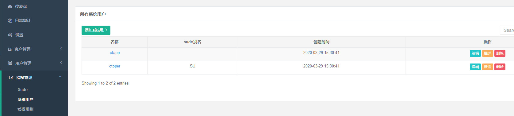

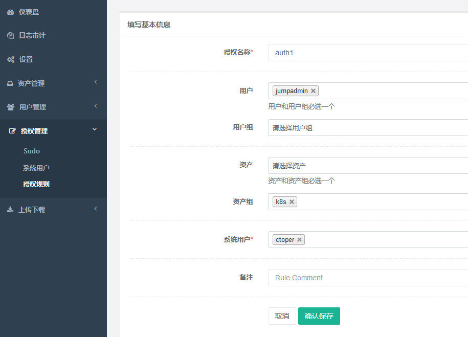

### 3.操作日志审计

- 操作日志审计

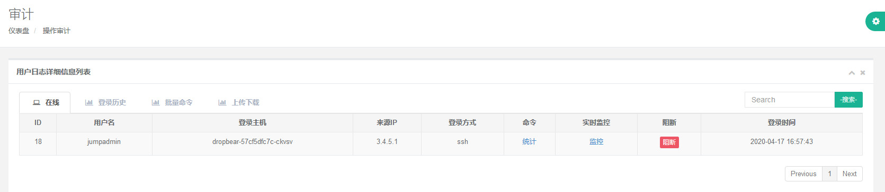

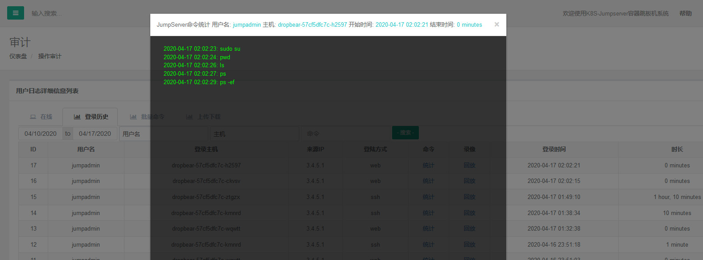

### 4.设置、文件上传下载

- 设置项

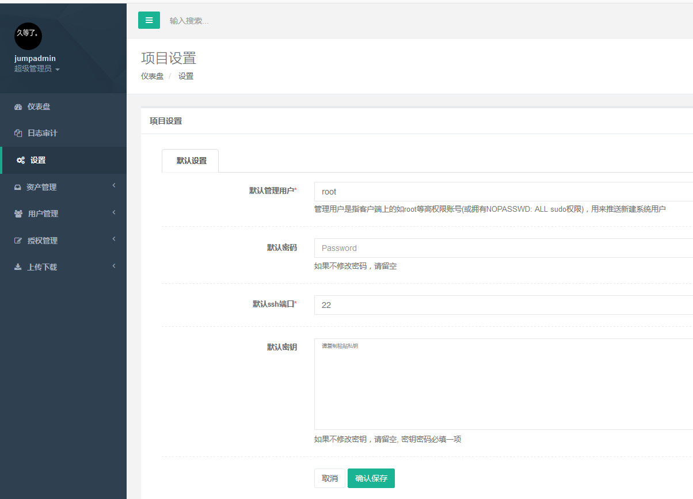

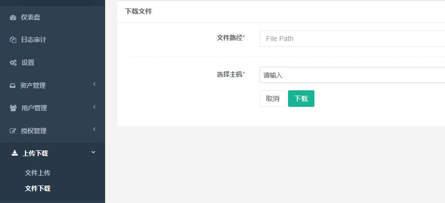

### 5.SSH下 rz/sz上传下载文件(SSH下特有、web控制台无此功能)

- rz/sz上传下载文件

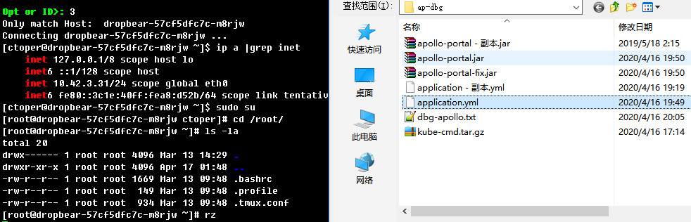

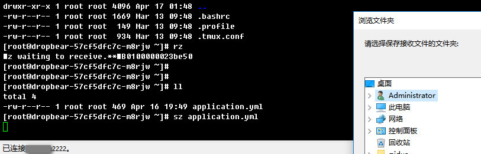

- UI后台的简易webSSH

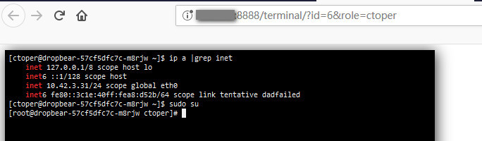

## 附1：K8S容器自注册说明

**1.条目项**

- 在K8S内跑jumpregister，定时扫描符合条件的pod，推送信息到跳板机注册
- 通过给业务编排的yaml设定Label `regist-jumpserver/enabled: enabled` Env `SSHD_ENABLE=true`  两处信息，以支持跳板机自动注册
- 基础容器的支持：当前跳板基于ssh来管理容器，容器镜像需要sshd的支持，建议用轻量的`dropbear` 详参考：`registry.cn-shenzhen.aliyuncs.com/infrastlabs/alpine-ext:weak`

**2.图示说明**

- 业务yaml设定 demo示例：(label+env)

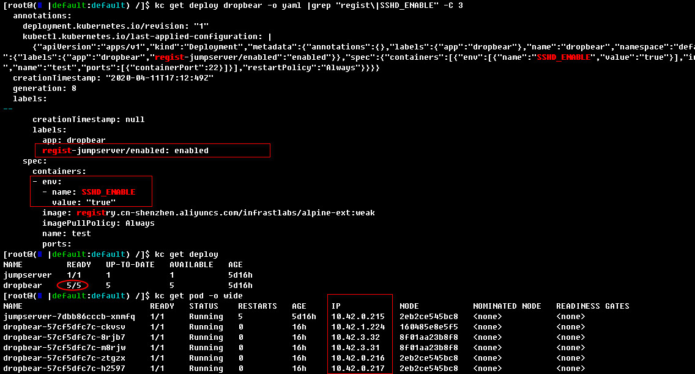

- jumpregister推送返回日志(里面有相对上一次的: exist/add/del详细记录)

## 附2：容器跳板机说明

基于官方`0.3.x`最后的一次commit`3533c010`做优化及适配K8S模式。原理：在K8S容器内启用轻量级的`dropbear`ssh-server；通过`jumpregister`定时推送最新POD清单到容器跳板机。Jumpserver可外置也可内置于集群内。`0.3.x`相比官方最新版本具有`小巧轻量` `专注便捷`同时又具备`核心功能`的特性，更适合仅通过web管理面板授权、SSH远程跳板连接的场景。

**优化改动**

- fix:下载用户时不删除，可重复下载
- fix:适配AlineLinux的/etc/shadow登录问题
- fix:容器环境下的cron定时清理修复
- 开启Jumpserver平台用户ssh密码登录
- 初始`jumpadmin`管理员，初始`ctoper` `ctapp`两个系统用户，设置项初始`root`管理用户
- feat: 实现批量主机推送接口`/hostpush/batch`，配合`jumpregister`一同使用
- 优化Dockerfile构建 `Dockerfile-env` `Dockerfile-dist`
- 
- 跟进官方最新变更，并做对比说明
- 批量优化界面样式: 1.class="col-sm-12"行覆盖整页； 2.去除无用"config"板手图标
- 优化管理员及普通用户图标
- nav菜单项优化布局
- 切换skin处 改静态图标
- 修改文案： K8S-Jumpserver | 容器跳板机系统； 2016-2020, devcn.fun容器版

